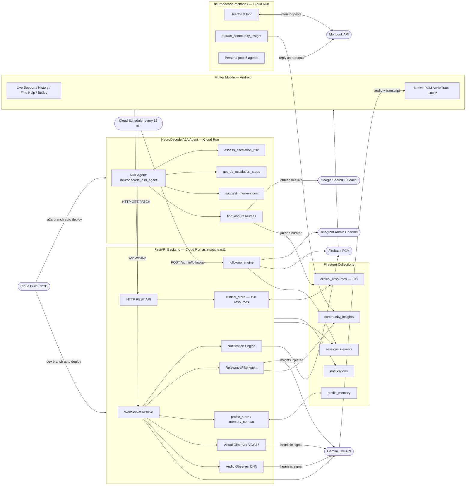

# NeuroDecode AI

NeuroDecode AI is a real-time multimodal caregiving copilot for high-stress sensory moments.

It is designed for caregivers who need immediate support without typing. The app can listen, optionally observe with camera context, and respond with calm, actionable guidance in the same session.

---

## Roadmap

Full build history from initial prototype to current state, plus planned next steps.

---

### Phase 0 — MVP ✅ Delivered


- Real-time caregiver co-pilot over WebSocket (`/ws/live`).
- Gemini Live API integration: push-to-talk → AI audio response streamed back.
- Audio Observer: custom Keras ML model trained on ASD behavioral audio cues, runs as a background heuristic signal.
- Visual Observer: camera frames analyzed in parallel for behavioral context.
- ASD caregiver system prompt engineering (non-diagnostic, non-judgmental, bilingual EN/ID).
- Deployed to Cloud Run (asia-southeast1).

---

### Phase 1 — Production Hardening & Session History ✅ Delivered

*Stability and persistence layer so real caregivers can use it beyond a demo.*

- Firestore session persistence (`sessions/` + `events/` collections).
- Post-session AI summary: title, triggers, agent actions, follow-up, safety note — generated via Gemini after session close.
- Fixed critical WebSocket stability bug (`asyncio.wait(FIRST_COMPLETED)` caused early session close after the first Gemini turn).
- Native Android PCM audio path: stable 24kHz playback with no crackling or latency buildup.
- Cloud Build CI/CD pipeline (`cloudbuild.yaml`) for automatic deployment on push to `dev`.
- History & Insights screen in Flutter: timeline of past sessions with structured summaries.

---

### Phase 2 — Proactive Push Notifications ✅ Delivered

*The app reaches out to caregivers — they don't have to remember to open it.*

- Rule-based proactive engine: analyses post-session data and fires FCM push notifications (e.g. safety follow-ups, check-ins).
- Firebase Cloud Messaging (FCM) → Android push delivery.
- `notifications/` Firestore collection: full notification history with read/unread state.
- Notifications Center screen in Flutter with unread badge.
- Push device token registration and deactivation (`/devices/push-token`).
- Telegram admin alert channel for monitoring session events.

---

### Phase 2.5 — In-App Follow-Up Response Flow ⏸ Deferred

*Caregivers respond to AI follow-ups directly inside the notification — not just reading them.*

- In-app notification tray with reply input (e.g. "How is your child now?").
- Follow-up response routing back to backend for AI processing.
- **Status:** FCM banners are delivered and visible. The in-app reply flow is deferred until post-hackathon announcement period.

---

### Phase 3A — Community Intelligence via Moltbook ✅ Delivered

*Harvest real caregiver community insights and inject them as context during live sessions.*

- Moltbook social API integration: `neurodecode-moltbook` agent (separate Cloud Run service) monitors Anak Unggul community posts.
- Incoming comments are parsed by `extract_community_insight()` → saved to `community_insights/` Firestore collection.
- `RelevanceFilterAgent`: single Gemini call (temperature 0.0) scores which community insights are relevant per active session profile.
- Relevant insights injected into session context alongside profile memory.
- Lives on branch `feature/moltbook-integration` wrapping the main backend.

---

### Phase 3B — Profile Memory & Personalization ✅ Delivered

*Agent remembers each child's specific triggers and what actually helps them.*

- Profile Workspace screen in Flutter: caregiver sets structured support preferences (known triggers, effective interventions, communication style, sensory profile).
- `profile_memory/` Firestore collection.
- At session start, backend retrieves profile memory context and injects it into the Gemini system prompt — Buddy responds with child-specific strategies, not generic ASD advice.
- Memory saving from History/Insights: AI surfaces suggested memory actions ("Save this trigger?") that caregivers can approve with one tap.
- Feature-flagged via `NEURODECODE_ENABLE_PROFILE_MEMORY_CONTEXT`.

---

### Phase 4 — Clinical Routing / Find Help ✅ Delivered

*"Bridging the gap between digital assistance and real-world care — connect caregivers with specialized ASD clinics, occupational therapists, or emergency telemedicine services."*

- Google Places API (New) harvest script: 196 ASD-relevant resources for Jakarta (clinics, therapists, hospitals, inclusive schools, community centres) stored in Firestore `clinical_resources/`.
- 2 manually seeded entries for Anak Unggul (Sunter + Kelapa Gading locations).
- 3 Firestore composite indexes for efficient filtering: `city+is_active`, `resource_type+is_active`, `city+resource_type+is_active`.
- REST API: `GET /clinical-resources` (filters: city, resource_type, active_only), `GET /clinical-resources/{id}`.
- Admin write API: `POST` / `PATCH /admin/clinical-resources` guarded by `X-Admin-Secret`.
- Flutter **Find Help** tab (4th bottom-nav item): resource cards with type badge, address, tap-to-copy phone, staleness warning, and filter chips (All / Clinic / Therapist / School / Hospital / Community).

---

### Phase 5 — Time-Delayed Proactive Pipelines ✅ Delivered

*"Utilizing Cloud Scheduler to send gentle check-in notifications hours after a severe meltdown to monitor the child's recovery."*

- `followup_engine.py`: scans Firestore for sessions with `followup_scheduled_at` set (high-severity or safety-flagged) and fires FCM follow-up push when the delay window passes.
- Cloud Scheduler job (`*/15 * * * *`) calls the backend `/admin/followup/process` endpoint every 15 minutes — no Cloud Tasks dependency.
- FCM delivery confirmed: session `212db6fe` received follow-up push.
- Telegram delivery confirmed: admin alert channel received the follow-up notification in real time.
- `followup_sent` Firestore flag prevents duplicate delivery on subsequent scheduler ticks.
- Two composite Firestore indexes support the followup scan: `followup_sent + followup_scheduled_at`.

---

### Phase 5.5 — In-App Follow-Up Reply Flow ⏸ Deferred

*Caregivers respond to AI follow-ups directly inside the notification — not just reading them.*

- In-app notification tray with reply input ("How is your child now?").
- Follow-up response routing back to backend for AI processing.
- **Status:** FCM banners delivered. In-app reply flow deferred post-hackathon.

---

### Phase 6 — Post-Session Feedback Rating ✅ Delivered

*Short caregiver feedback loop — did this session actually help?*

- 1–5 star tappable rating shown in each session card inside the History / Insights screen.
- `PATCH /sessions/{session_id}/rate` endpoint writes `caregiver_rating` to the `sessions/` Firestore document.
- Optimistic UI update in Flutter — star selection locks immediately while the request completes in the background.
- Used downstream to weight intervention effectiveness in profile memory suggestions.

---

### Phase 7 — A2A Agent Protocol ✅ Delivered

*Expose NeuroDecode's caregiver tools as a standards-compliant A2A (Agent-to-Agent) service so any AI platform or orchestrator can invoke them.*

- `neurodecode_a2a` microservice: Google ADK `Agent` wrapping 4 callable tools, deployed as a separate Cloud Run service.
- `find_asd_resources` — Jakarta uses curated Firestore database (198 resources); all other cities hit live Google Search + Gemini for real-time results worldwide.
- `suggest_interventions` — evidence-based strategies for a given ASD trigger (e.g. "loud noise sensitivity").
- `get_de_escalation_steps` — step-by-step active-distress protocol for caregivers.
- `assess_escalation_risk` — structured risk assessment from a behavioral pattern description.
- A2A agent card at `/.well-known/agent-card.json` (protocolVersion 0.2.2, preferredTransport JSONRPC).
- 3-layer cost control: in-memory LRU cache → Firestore 24h TTL cache → 5 req/hr rate limit per location.
- Optional API key auth via `ApiKeyMiddleware` (`A2A_REQUIRE_AUTH` env flag).
- Dedicated Cloud Build pipeline (`cloudbuild_a2a.yaml`) — separate from main backend deployments.

---

### Phase 8 — Knowledge Harvest Agent 🔲 Planned

*Ground Buddy's guidance in current ASD science, not just community posts.*

- PubMed RSS + Autism Speaks RSS → `knowledge_base/` Firestore collection.
- Gemini call to extract structured intervention evidence per article.
- Injected alongside community insights as a third context tier during live sessions.

---

### Phase 9 — Longitudinal Analytics Dashboard 🔲 Planned

*"Exporting Firestore session data to BigQuery to help caregivers and therapists visualize trigger trends and intervention success rates over months."*

- BigQuery export pipeline for session and event data.
- Caregiver dashboard: trigger frequency charts, intervention success rates, session duration trends over months.
- Therapist/clinician sharing view (read-only link).
- Optional: session export to PDF for clinical appointments.

---

## Product Snapshot (Current)

Current implemented user flow:

1. Choose `Audio only` or `Video + audio` in the Support tab.
2. Select or enter a `Profile ID`.
3. Start live session and speak with push-to-talk.
4. Receive Gemini guidance (audio + transcript).
5. Review post-session summary in History / Insights.
6. Save suggested memories (trigger/follow-up) to profile memory.
7. Receive proactive follow-up push notification hours after a high-severity session.
8. Browse ASD clinics, therapists, and schools in the **Find Help** tab.

Major capabilities running in production:

1. Multi-turn live session over WebSocket (`/ws/live`).
2. Native Android PCM playback path for stable 24kHz output.
3. Profile Workspace with structured support preferences.
4. Retrieval-based profile memory context for live session personalization.
5. Firestore-backed session history with fallback memory store.
6. Suggested memory actions from History / Insights.
7. Rule-based proactive push notifications after session close (FCM).
8. Time-delayed follow-up push notifications via Cloud Scheduler (every 15 min scan, FCM delivery confirmed).
9. Clinical resource directory: 198 Jakarta ASD resources with REST API and Flutter UI.

## Why It Matters

During sensory escalation, caregivers usually cannot stop and type long prompts.

NeuroDecode reduces caregiver cognitive load with a live loop:

1. Hear context (mic stream).
2. Optionally see context (camera observer mode).
3. Respond instantly with practical support steps.

## Architecture (High-Level)



## Repository Structure

```text
NeuroDecode/
|- README.md
|- cloudbuild.yaml           ← main backend CI/CD
|- cloudbuild_a2a.yaml       ← A2A agent CI/CD

|- neurodecode_backend/
|  |- README.md
|  |- requirements.txt
|  |- scripts/
|  |  |- ws_smoke_test.py
|  |  |- memory_eval_probe.py
|  |  |- harvest_clinical_places.py
|  |  |- seed_clinical_resources.py
|  |- app/
|  |  |- main.py
|  |  |- settings.py
|  |  |- gemini_live.py
|  |  |- ai_processor.py
|  |  |- clinical_store.py
|  |  |- community_store.py
|  |  |- push_sender.py
|  |  |- push_device_store.py
|  |  |- notification_store.py
|  |  |- rule_debug_store.py
|  |  |- models/
|- neurodecode_a2a/           ← Phase 7 A2A Agent service
|  |- agent.py               ← ADK Agent definition (4 tools)
|  |- app.py                 ← FastAPI server + agent card
|  |- middleware.py          ← ApiKeyMiddleware
|  |- requirements.txt
|  |- tools/
|  |  |- clinical.py         ← find_asd_resources (Jakarta + global)
|  |  |- asd_reasoning.py    ← suggest_interventions, de-escalation, risk
|- neurodecode_mobile/
   |- README.md
   |- pubspec.yaml
   |- lib/
      |- features/support/
      |- features/live_agent/
      |- features/home/
      |- features/profile/
      |- features/clinical/        ← Find Help screen
      |- features/shell/
   |- android/
      |- app/build.gradle
      |- settings.gradle
```

## Quick Start

### Backend (FastAPI)

Requirements:

1. Python 3.10+
2. Gemini API key
3. Optional Firestore credentials for local run

```powershell
cd c:\PROJ\NeuroDecode\neurodecode_backend
python -m venv .venv
.\.venv\Scripts\python -m pip install --upgrade pip
.\.venv\Scripts\pip install -r requirements.txt

$env:GEMINI_API_KEY = "YOUR_KEY_HERE"
$env:NEURODECODE_SUMMARY_ENABLED = "1"
$env:NEURODECODE_SUMMARY_MODEL = "gemini-2.5-flash-lite"
$env:NEURODECODE_FIRESTORE_ENABLED = "1"
$env:NEURODECODE_ENABLE_PROFILE_MEMORY_CONTEXT = "1"

.\.venv\Scripts\python -m uvicorn app.main:app --reload --host 0.0.0.0 --port 8000
```

Health check:

```powershell
curl.exe -s http://127.0.0.1:8000/health
```

### Mobile (Flutter)

```powershell
cd c:\PROJ\NeuroDecode\neurodecode_mobile
flutter pub get
flutter run
```

Set backend host in:

1. `neurodecode_mobile/lib/config/app_config.dart`

## Core API / Protocol

Key HTTP endpoints:

1. `GET /sessions`
2. `GET /sessions/latest`
3. `PATCH /sessions/{session_id}/rate` (query: `rating=1..5`) ← Phase 6
4. `GET /profiles/{profile_id}`
5. `PUT /profiles/{profile_id}`
6. `GET /profiles/{profile_id}/memory`
7. `POST /profiles/{profile_id}/memory`
8. `GET /profiles/{profile_id}/memory-context`
9. `POST /devices/push-token`
10. `POST /devices/push-token/deactivate`
11. `GET /notifications`
12. `POST /notifications/{id}/read`
13. `GET /clinical-resources` (optional: `?city=jakarta&resource_type=clinic&limit=50`)
14. `GET /clinical-resources/{id}`
15. `POST /admin/clinical-resources` (`X-Admin-Secret` required)
16. `PATCH /admin/clinical-resources/{id}` (`X-Admin-Secret` required)
17. `GET /admin/rules/debug` (admin token required)
18. `GET /admin/push/devices` (admin token required)
19. `POST /admin/push/test` (admin token required)

WebSocket:

1. `GET /ws/live` (query: `user_id`, optional `profile_id`)

Important server event:

1. `profile_memory_status` indicates profile memory context is active for the session.

## Environment Variables (Important)

Core:

1. `GEMINI_API_KEY`
2. `NEURODECODE_LIVE_MODEL`
3. `NEURODECODE_RESPONSE_MODALITY`

Memory / profile:

1. `NEURODECODE_ENABLE_PROFILE_MEMORY_CONTEXT`
2. `NEURODECODE_PROFILE_MEMORY_ITEM_LIMIT`
3. `NEURODECODE_PROFILE_MEMORY_SESSION_LIMIT`

Summary / notifications:

1. `NEURODECODE_SUMMARY_ENABLED`
2. `NEURODECODE_SUMMARY_MODEL`
3. `TELEGRAM_BOT_TOKEN`
4. `TELEGRAM_CHAT_ID`

Firestore:

1. `NEURODECODE_FIRESTORE_ENABLED`
2. `NEURODECODE_FIRESTORE_COLLECTION`
3. `NEURODECODE_FIRESTORE_EVENT_COLLECTION`
4. `NEURODECODE_FIRESTORE_PROFILE_COLLECTION`
5. `NEURODECODE_FIRESTORE_PROFILE_MEMORY_COLLECTION`
6. `NEURODECODE_FIRESTORE_PROJECT`

Admin debug (optional):

1. `NEURODECODE_ADMIN_DEBUG_ENABLED`
2. `NEURODECODE_ADMIN_DEBUG_TOKEN`
3. `NEURODECODE_ADMIN_DEBUG_MAX_ITEMS`

FCM push (optional, feature-flagged):

1. `NEURODECODE_FCM_ENABLED`
2. `NEURODECODE_FIRESTORE_PUSH_DEVICE_COLLECTION`

## Secure Rollout (Cloud Run)

Use this sequence for safe activation without exposing secrets in git.

1. Keep all new flags `OFF` by default in production.
2. Store sensitive values in Secret Manager (do not hardcode in repo or `cloudbuild.yaml`).
3. Enable admin debug first, verify output, then enable FCM.

Suggested Secret Manager names:

1. `neurodecode-gemini-api-key`
2. `neurodecode-admin-debug-token`

Cloud Run update (PowerShell) - baseline runtime (replace project/region/service as needed):

```powershell
gcloud run services update neurodecode-backend `
    --project gen-lang-client-0348071142 `
    --region asia-southeast1 `
    --platform managed `
    --set-secrets GEMINI_API_KEY=neurodecode-gemini-api-key:latest `
    --set-secrets NEURODECODE_ADMIN_DEBUG_TOKEN=neurodecode-admin-debug-token:latest `
    --update-env-vars NEURODECODE_ADMIN_DEBUG_ENABLED=1,NEURODECODE_ADMIN_DEBUG_MAX_ITEMS=500,NEURODECODE_FCM_ENABLED=0,NEURODECODE_FIRESTORE_PUSH_DEVICE_COLLECTION=push_device_tokens
```

Enable FCM after admin debug passes:

```powershell
gcloud run services update neurodecode-backend `
    --project gen-lang-client-0348071142 `
    --region asia-southeast1 `
    --platform managed `
    --update-env-vars NEURODECODE_FCM_ENABLED=1
```

Quick verification after update:

```powershell
gcloud run services describe neurodecode-backend `
    --project gen-lang-client-0348071142 `
    --region asia-southeast1 `
    --platform managed `
    --format="yaml(spec.template.spec.containers[0].env)"
```

If live session suddenly shows `GEMINI_API_KEY is required`, re-apply the `--set-secrets GEMINI_API_KEY=...` command above because Cloud Run runtime env is source-of-truth (local `.env` does not apply to Cloud Run).

Admin debug endpoint usage (read-only):

```text
GET /admin/rules/debug?admin_token=<TOKEN>&profile_id=<PROFILE_ID>&limit=20
GET /admin/push/devices?admin_token=<TOKEN>&user_id=<USER_ID>&profile_id=<PROFILE_ID>&limit=20
POST /admin/push/test?admin_token=<TOKEN>&user_id=<USER_ID>&profile_id=<PROFILE_ID>
```

FCM activation checklist (after admin debug is healthy):

1. Device registers token via `POST /devices/push-token`.
2. If needed, deactivate stale token via `POST /devices/push-token/deactivate`.
3. Use admin test push endpoint before enabling production fanout.
4. Backend receives proactive notifications as usual.
5. Turn on `NEURODECODE_FCM_ENABLED=1`.
6. Verify push send count in Cloud Run logs (`[push] Sent proactive push ...`).

Android Firebase setup required for token issuance:

1. Add [neurodecode_mobile/android/app/google-services.json](neurodecode_mobile/android/app/google-services.json) from Firebase Console for app id `com.neurodecode.neurodecode_mobile`.
2. Ensure Google Services Gradle plugin is enabled in [neurodecode_mobile/android/settings.gradle](neurodecode_mobile/android/settings.gradle) and [neurodecode_mobile/android/app/build.gradle](neurodecode_mobile/android/app/build.gradle).
3. Rebuild app after adding file so `FirebaseMessaging.getToken()` can return a valid token.

## Known Current Gaps

These are tracked and expected in current phase:

1. Mid-response audio can still feel slightly slow on some devices.
2. Camera preview may fail to initialize on certain OEM/driver combinations (retry fallback exists).
3. FCM banner delivery depends on valid Firebase app setup (`google-services.json`) and valid device token registration.


## Release Regression Checklist

Run this checklist before each release/deploy that touches live session, prompt, or audio path.

1. Audio-only single turn
    - Push-to-talk once (>1 second).
    - Expect: transcript appears and AI audio response plays clearly.
2. Audio-only multi-turn
    - Send at least 3 turns in one session.
    - Expect: no duplicated opening audio, no robotic slowdown, state transitions stay normal.
3. Video observer on
    - Start `Video + audio` mode.
    - Pause/resume and drag observer preview.
    - Expect: camera controls work, live response still stable.
4. Session summary persistence
    - End session normally.
    - Expect: summary record saved and visible via `/sessions/latest`.
5. History / Insights rendering
    - Open History screen in app.
    - Expect: latest summary fields load and render correctly.
6. Profile memory context handshake
    - Start live with valid Profile ID.
    - Expect: `profile_memory_status` appears and memory cues are shown when available.
7. Proactive notifications baseline
    - After eligible session data, open notifications center.
    - Expect: unread/read behavior works and references correct session/profile.

Suggested status format per item: `PASS`, `FAIL`, `N/A`.


## Data / Model References

1. Video NN reference: https://github.com/AutismBrainBehavior/Video-Neural-Network-ASD-screening
2. Audio NN reference: https://github.com/AutismBrainBehavior/Audio-Neural-Network-ASD-screening
3. Training notebook: `asd_agent_training.ipynb`


