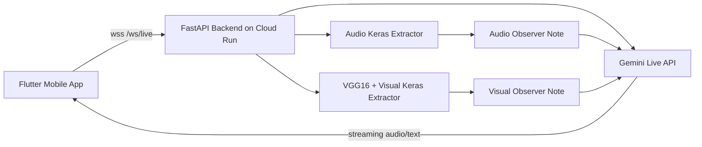

# NeuroDecode AI
NeuroDecode AI is a real-time, multimodal caregiving & parents copilot.

It is designed to support caregivers of autistic children during high-stress moments, where typing into an app is not realistic. Instead of waiting for long prompts, NeuroDecode can observe live context from camera and audio, then respond with calm, practical guidance.

## Why We Built This
Caregiving during sensory overload or meltdown moments requires immediate support, not delayed Q&A.

NeuroDecode was built to reduce caregiver cognitive load by combining three abilities in one live loop:
1. See behavior cues from camera frames.
2. Hear distress signals from audio chunks.
3. Speak actionable guidance through Gemini Live.

## How It Works: See, Hear, Speak
NeuroDecode uses a two-layer AI pipeline:
1. Local sensor stream from Flutter app (camera and mic).
2. Cloud intelligence in FastAPI backend with Gemini Live plus custom Keras models.

Core flow:
1. Flutter sends audio and periodic camera frames through WebSocket.
2. Backend runs best-effort Keras inference with lazy loading.
3. Backend sends internal observer notes to Gemini Live as private context.
4. Gemini responds naturally to caregiver with concise, supportive intervention steps.

Technical highlights:
1. Visual observer uses VGG16 feature extraction plus custom behavior extractor model.
2. Audio observer uses MFCC features plus custom Conv1D-based extractor model.
3. Gemini system instruction explicitly prevents raw observer-note leakage.
4. Idle timeout auto-disconnect (45s) reduces runaway session cost.
5. Cloud Build deploys to Cloud Run with `4Gi` memory for TensorFlow workload.

## Architecture (High-Level)


## Repository Structure
```text
NeuroDecode/
|- cloudbuild.yaml
|- asd_agent_training.ipynb
|- neurodecode_backend/
|  |- Dockerfile
|  |- requirements.txt
|  |- app/
|  |  |- main.py
|  |  |- gemini_live.py
|  |  |- ai_processor.py
|  |  |- models/
|  |  |  |- autism_behavior_extractor.keras
|  |  |  |- autism_audio_extractor.keras
|  |- scripts/
|- neurodecode_mobile/
   |- lib/
      |- config/app_config.dart
```

## Quick Start
### 1. Backend (FastAPI + Gemini Live + Keras)
Requirements:
1. Python 3.10+ (3.11 recommended)
2. Google Cloud project
3. Gemini API key
4. gcloud CLI authenticated

Local run:
```powershell
cd c:\PROJ\NeuroDecode\neurodecode_backend
python -m venv .venv
.\.venv\Scripts\python -m pip install --upgrade pip
.\.venv\Scripts\pip install -r requirements.txt
$env:GEMINI_API_KEY = "YOUR_KEY_HERE"
$env:NEURODECODE_SUMMARY_ENABLED = "1"
$env:NEURODECODE_SUMMARY_MODEL = "gemini-2.0-flash"
$env:TELEGRAM_BOT_TOKEN = "YOUR_TELEGRAM_BOT_TOKEN"
$env:TELEGRAM_CHAT_ID = "YOUR_TELEGRAM_CHAT_ID"
.\.venv\Scripts\python -m uvicorn app.main:app --reload --host 0.0.0.0 --port 8000
```

Health check:
```powershell
curl.exe -s http://127.0.0.1:8000/health
```

Expected response:
```json
{"status":"ok"}
```

### 2. Mobile App (Flutter)
```powershell
cd c:\PROJ\NeuroDecode\neurodecode_mobile
flutter pub get
flutter run
```

Set backend URL in:
- `neurodecode_mobile/lib/config/app_config.dart`

Current pattern:
```dart
static const String backendUrl = 'YOUR_CLOUD_RUN_HOST';
static const String wsEndpoint = 'wss://$backendUrl/ws/live';
```

## Cloud Deployment (Automated)
Cloud Build trigger uses root `cloudbuild.yaml` and deploys to Cloud Run service `neurodecode-backend` in `asia-southeast1`.

Manual deploy alternative:
```powershell
cd c:\PROJ\NeuroDecode\neurodecode_backend
gcloud run deploy neurodecode-backend --source . --region asia-southeast1 --allow-unauthenticated --timeout 3600 --concurrency 1 --memory 4Gi
```

## Runtime Notes
1. Backend is real-only mode. `GEMINI_API_KEY` is required.
2. Observer notes are private context for Gemini, not user-facing text.
3. TensorFlow models are lazy-loaded at first inference call to reduce cold start impact.
4. First vision/audio inference may have higher latency due to model initialization.
5. Post-crisis summary runs on session close with `NEURODECODE_SUMMARY_MODEL` (default `gemini-2.0-flash`).
6. Telegram notification is sent only when `TELEGRAM_BOT_TOKEN` and `TELEGRAM_CHAT_ID` are set.
7. Telegram format uses `MarkdownV2` with character escaping to avoid API error 400.

## Session Summary API
Use this endpoint to render History/Insight in Flutter after a session ends.

```http
GET /sessions/latest
```

Example response:
```json
{
    "status": "ok",
    "session": {
        "timestamp_utc": "2026-03-07T12:34:56.000000+00:00",
        "duration_seconds": 240,
        "duration_minutes": 4,
        "close_reason": "idle_timeout",
        "summary_text": "TITLE: ...",
        "structured": {
            "title": "...",
            "triggers_visual": "...",
            "triggers_audio": "...",
            "agent_actions": "...",
            "follow_up": "...",
            "safety_note": "..."
        }
    }
}
```

## Data and Model Sources
Model and training references:
1. Video NN reference: https://github.com/AutismBrainBehavior/Video-Neural-Network-ASD-screening
2. Audio NN reference: https://github.com/AutismBrainBehavior/Audio-Neural-Network-ASD-screening

Audio dataset references:
1. UrbanSound8K: https://urbansounddataset.weebly.com/urbansound8k.html
2. Additional proprietary source: Anak Unggul caregiver recordings (used for ASD-oriented distress signal context)

Notebook in this repo:
- `asd_agent_training.ipynb`


