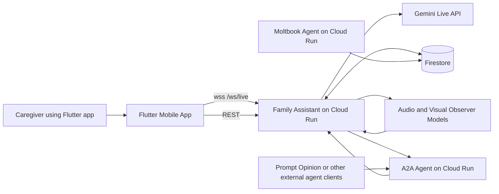
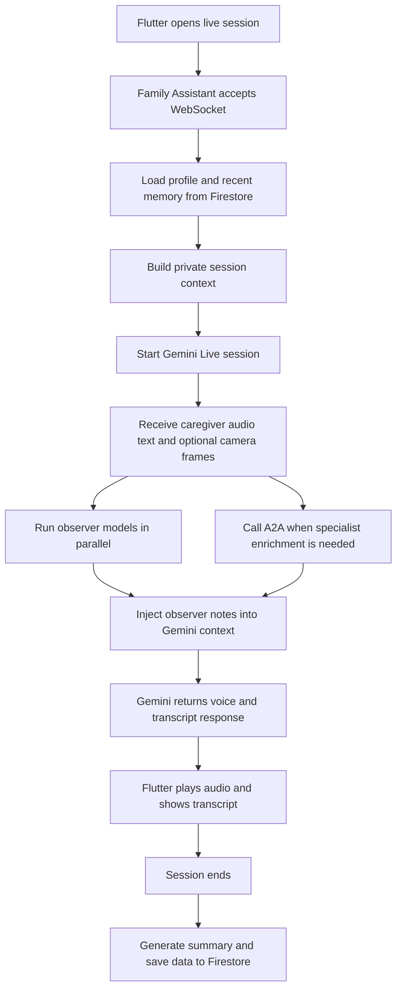
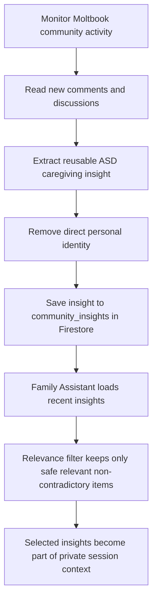
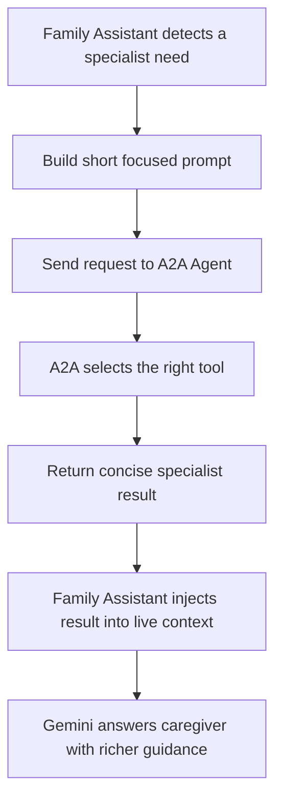

# NeuroDecode

NeuroDecode is the platform and system architecture behind AnakUnggul, a multimodal ASD caregiver support experience built around three cooperating services:

1. Family Assistant, the main live session orchestrator.
2. Moltbook Agent, the community insight harvester.
3. A2A Agent, the specialist reasoning and resource agent.

The goal is simple: when a caregiver faces a stressful sensory moment, the system should listen, observe, remember useful context, and answer with calm, practical guidance without making the caregiver do extra work.

For product naming, the clearest split is:

1. AnakUnggul for the public-facing app and user experience.
2. NeuroDecode for the technical platform and repository.
3. Family Assistant for the live orchestration agent inside the platform.

## What NeuroDecode Does

NeuroDecode combines:

1. A Flutter mobile app for live support.
2. A FastAPI backend for orchestration.
3. Gemini Live for real-time conversation.
4. Firestore for memory and session data.
5. Keras observer models for audio and visual signals.
6. A community insight pipeline through Moltbook.
7. An A2A service for specialist tools and ASD resource lookup.


## High-Level Architecture



## Three Main Services

### 1. Family Assistant

Family Assistant is the main brain of the product flow. It is the service that owns the live caregiver session.

Its responsibilities are:

1. Receive audio, text, and optional camera input from the Flutter app.
2. Load profile facts, curated memory, and recent session patterns.
3. Inject safe, relevant context into Gemini.
4. Run observer models in the background.
5. Ask the A2A Agent for specialist help when needed.
6. Save session summaries, events, and notifications to Firestore.

In practice, Family Assistant is not just chat. It is the orchestrator that coordinates memory, observers, Gemini, storage, and external enrichment.

#### Family Assistant Flow



#### Family Assistant Input

Family Assistant receives:

1. Audio chunks from the microphone.
2. Optional camera frames.
3. Text messages.
4. `user_id` and optional `profile_id`.

#### Family Assistant Output

Family Assistant returns:

1. Spoken Gemini responses.
2. Input and output transcripts.
3. Observer notes.
4. Profile-memory status for the current session.
5. Post-session summary and follow-up data saved to Firestore.

#### Private Memory in Family Assistant

Private memory is internal context prepared by the backend for Gemini. It is called private because it is not meant to be quoted directly back to the caregiver.

It can include:

1. Profile facts.
2. Curated memory items.
3. Patterns from recent sessions.
4. Filtered community insights.

This is not the same as anonymous data. It is internal session context and must still be treated as sensitive profile data.

### 2. Moltbook Agent

Moltbook Agent is not the live session agent. It works upstream.

Its job is to observe public ASD caregiver discussions, extract reusable insight, and store only anonymized insight text for later use.

Think of Moltbook as a community-learning pipeline, not a direct chat assistant for the caregiver session.

#### Moltbook Flow



#### What Moltbook Stores

The shared Firestore layer stores anonymized community insight, not caregiver profile data from a live session.

Examples of what belongs here:

1. A calming strategy that often helps in noisy places.
2. A practical tip from educators for sensory overload.
3. A community suggestion about managing transitions.

Examples of what should not be stored here:

1. Private caregiver identity.
2. Profile-specific personal notes from a child session.
3. Raw conversation dumps from Family Assistant.

#### Why Moltbook Matters

Moltbook gives NeuroDecode a second knowledge layer beyond profile memory.

Without it, Family Assistant only knows:

1. the current child profile,
2. recent sessions,
3. generic model knowledge.

With Moltbook, Family Assistant also gains community-derived insight, as long as it is filtered so it does not contradict the child profile.

### 3. A2A Agent

A2A Agent is a separate specialist service. It is not the main session owner and it is not the main database.

Its role is to answer focused specialist requests such as:

1. ASD resource lookup.
2. De-escalation guidance.
3. Escalation risk assessment.
4. Sensory strategy suggestions.
5. Caregiver wellbeing support.
6. Therapist handover drafting.

#### A2A Flow



#### Important A2A Design Notes

1. A2A communicates directly with Family Assistant over HTTP.
2. A2A is fail-open, so if it is slow or unavailable, the live session still continues.
3. A2A is not the persistent memory store for live sessions.
4. A2A can enrich the current session context, but that does not automatically become long-term memory.
5. A2A is also exposed as a separate agent for external ecosystems such as Prompt Opinion.

## How The Three Services Work Together

In one sentence:

1. Family Assistant runs the session.
2. Moltbook contributes community knowledge.
3. A2A contributes specialist reasoning and resource lookup.

The collaboration looks like this:

1. Flutter starts a live session with Family Assistant.
2. Family Assistant loads profile memory and recent session patterns from Firestore.
3. Family Assistant optionally adds filtered Moltbook insights.
4. Observer models watch audio and vision signals.
5. If needed, Family Assistant asks A2A for specialist help.
6. Gemini responds using all of that context.
7. After the session, Family Assistant saves the result back to Firestore.

## Observer Models and Thresholds

The observer models are background sensors, not final decision makers.

They produce signals from:

1. audio patterns,
2. visual patterns.

Those signals only become observer notes when they pass a threshold.

A threshold is simply the decision boundary that says:

1. below this score, do nothing,
2. above this score, inject an internal observer note.

This helps the live session stay practical. The model should not interrupt Gemini for every weak signal, but it also should not miss strong signals that may indicate distress or overload.

## Data, Notebook, and Keras Models

The project keeps the training and adaptation workflow visible in the repository.

### Training Notebook

1. Notebook: `Asd_Agent_Training.ipynb`
2. Purpose: prepare and adapt audio and video pipelines used for observer features.

### Model Files Used in Backend

1. `neurodecode_backend/app/models/autism_audio_extractor.keras`
2. `neurodecode_backend/app/models/autism_behavior_extractor.keras`

These models are used as observer feature extractors during live sessions. They support context enrichment and are not positioned as clinical diagnostic models.

### Source Repositories Referenced in the Notebook

The notebook uses public GitHub sources from AutismBrainBehavior to help shape the project pipeline:

1. https://github.com/AutismBrainBehavior/Video-Neural-Network-ASD-screening
2. https://github.com/AutismBrainBehavior/Audio-Neural-Network-ASD-screening

These repositories are used to help the notebook workflow and code adaptation in this project.

### Dataset References Used in the Notebook Workflow

The notebook references:

1. video data under `data_video_skeleton/training_set` , `data_video_skeleton/testing_set`
2. ASD audio data under `data_audio_noise/ASD_Audio`
3. environmental noise audio under `data_audio_noise/UrbanSound8K/audio`
4. UrbanSound8K as the noise audio source used in the workflow

## Main Features

Current implemented capabilities include:

1. Live caregiver support over WebSocket with voice response.
2. Optional audio plus camera session mode.
3. Firestore-backed session history and summaries.
4. Profile memory and child-specific personalization.
5. Community insight injection through Moltbook.
6. A2A specialist tools and Prompt Opinion interoperability.
7. ASD clinical resource lookup.
8. Push notifications and follow-up reminders.
9. Flutter screens for Support, Home, Find Help, and Buddy profile workspace.

## Technology Stack

### Application Layer

1. Flutter mobile app.
2. FastAPI backend.
3. Separate FastAPI-based A2A service.

### AI Layer

1. Gemini Live API for real-time conversation.
2. Gemini text models for filtering and summary generation.
3. TensorFlow and Keras for observer models.

### Data and Infrastructure

1. Firestore for profiles, memory, sessions, notifications, and shared community insights.
2. Cloud Run for backend and A2A deployment.
3. Cloud Build for deployment pipelines.
4. Firebase Cloud Messaging for mobile notifications.

## Technical Documentation

The main README stays intentionally high-level.

For implementation details, use the component READMEs:

1. Backend technical details: `neurodecode_backend/README.md`
2. Mobile and Flutter technical details: `neurodecode_mobile/README.md`
3. A2A service details: the `neurodecode_a2a` service folder and source files

## Cloud and Firestore Overview

NeuroDecode is designed so that the mobile app stays thin and the main logic stays on the cloud.

### Cloud Run

Cloud Run hosts:

1. the main Family Assistant backend,
2. the A2A Agent service,
3. supporting deployed services such as the Moltbook pipeline when enabled.

### Firestore

Firestore is the long-term data layer for:

1. profiles,
2. profile memory,
3. sessions,
4. session events,
5. notifications,
6. clinical resources,
7. community insights.

### Relationship with Flutter

The Flutter app does not run orchestration logic locally.

Instead:

1. Flutter sends live input to Family Assistant on Cloud Run.
2. Family Assistant talks to Gemini, Firestore, observer models, and A2A.
3. Flutter receives only the session outputs it needs to present to the caregiver.

## Repository Structure

```text
NeuroDecode/
|- README.md
|- Asd_Agent_Training.ipynb
|- cloudbuild.yaml
|- cloudbuild_a2a.yaml
|- firestore.indexes.json
|- neurodecode_backend/
|  |- app/
|  |  |- main.py
|  |  |- ai_processor.py
|  |  |- memory_context.py
|  |  |- relevance_filter.py
|  |  |- community_store.py
|  |  |- profile_store.py
|  |  |- session_store.py
|  |  |- notification_store.py
|  |  |- models/
|  |- scripts/
|- neurodecode_a2a/
|  |- app.py
|  |- agent.py
|  |- tools/
|- neurodecode_mobile/
|  |- lib/
|  |  |- features/
|  |  |- config/
```

## Run The Project

For local setup, use the component-specific guides:

1. Backend setup and Cloud Run notes: `neurodecode_backend/README.md`
2. Flutter app setup and Firebase notes: `neurodecode_mobile/README.md`
3. A2A local setup: `neurodecode_a2a` service folder

## Current Feature Summary

NeuroDecode currently focuses on five practical outcomes:

1. support the caregiver in the moment,
2. remember what helps a specific child,
3. reuse safe community insight,
4. connect caregivers to relevant ASD resources,
5. keep improving through session summaries and follow-up loops.

## Long-Term Direction

The long-term direction for NeuroDecode and AnakUnggul includes:

1. FHIR interoperability integration so longitudinal data and AI-generated therapist handover notes can integrate securely with hospital EHR systems.
2. Context-aware clinical routing using healthcare directory APIs to guide caregivers to the nearest relevant ASD clinics based on session severity.
3. Longitudinal analytics dashboards by exporting Firestore data to BigQuery so therapists can track triggers, interventions, and progress over time.
4. Data anonymization research to strip PII so the real-world caregiving dataset can support ASD academic research safely.
5. Richer specialist skills in A2A, including more AI-agent perspectives beyond human community insight.
6. More robust knowledge harvesting from scientific and professional sources.
7. Clearer explainability in how memory, observers, and enrichment affect responses.

## Notes

1. Family Assistant is the main session orchestrator.
2. Moltbook Agent is the community insight producer.
3. A2A Agent is the specialist enrichment layer.
4. Firestore remains the main persistent data layer.
5. Keras observer models support real-time context enrichment, not diagnosis.