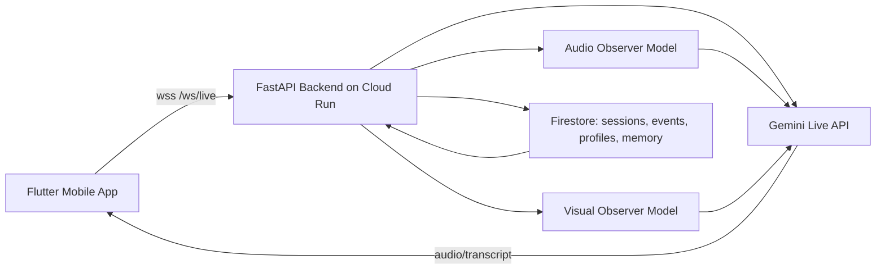

# NeuroDecode AI

NeuroDecode AI is a real-time multimodal caregiving copilot for high-stress sensory moments.

It is designed for caregivers who need immediate support without typing. The app can listen, optionally observe with camera context, and respond with calm, actionable guidance in the same session.

## Product Snapshot (Current)

Current implemented user flow:

1. Choose `Audio only` or `Video + audio` in Support.
2. Select or enter a `Profile ID`.
3. Start live session and speak with push-to-talk.
4. Receive Gemini guidance (audio + transcript).
5. Review post-session summary in History / Insights.
6. Save suggested memories (trigger/follow-up) to profile memory.

Major capabilities already running:

1. Multi-turn live session over WebSocket (`/ws/live`).
2. Native Android PCM playback path for stable 24kHz output.
3. Profile Workspace with structured support preferences.
4. Retrieval-based profile memory context for live session personalization.
5. Firestore-backed session history with fallback memory store.
6. Suggested memory actions from History / Insights.

## Why It Matters

During sensory escalation, caregivers usually cannot stop and type long prompts.

NeuroDecode reduces caregiver cognitive load with a live loop:

1. Hear context (mic stream).
2. Optionally see context (camera observer mode).
3. Respond instantly with practical support steps.

## Architecture (High-Level)



## Repository Structure

```text
NeuroDecode/
|- README.md
|- cloudbuild.yaml

|- neurodecode_backend/
|  |- README.md
|  |- requirements.txt
|  |- app/
|  |  |- main.py
|  |  |- settings.py
|  |  |- gemini_live.py
|  |  |- ai_processor.py
|  |  |- models/
|- neurodecode_mobile/
   |- README.md
   |- lib/
      |- features/support/
      |- features/live_agent/
      |- features/home/
      |- features/profile/
```

## Quick Start

### Backend (FastAPI)

Requirements:

1. Python 3.10+
2. Gemini API key
3. Optional Firestore credentials for local run

```powershell
cd c:\PROJ\NeuroDecode\neurodecode_backend
python -m venv .venv
.\.venv\Scripts\python -m pip install --upgrade pip
.\.venv\Scripts\pip install -r requirements.txt

$env:GEMINI_API_KEY = "YOUR_KEY_HERE"
$env:NEURODECODE_SUMMARY_ENABLED = "1"
$env:NEURODECODE_SUMMARY_MODEL = "gemini-2.5-flash-lite"
$env:NEURODECODE_FIRESTORE_ENABLED = "1"
$env:NEURODECODE_ENABLE_PROFILE_MEMORY_CONTEXT = "1"

.\.venv\Scripts\python -m uvicorn app.main:app --reload --host 0.0.0.0 --port 8000
```

Health check:

```powershell
curl.exe -s http://127.0.0.1:8000/health
```

### Mobile (Flutter)

```powershell
cd c:\PROJ\NeuroDecode\neurodecode_mobile
flutter pub get
flutter run
```

Set backend host in:

1. `neurodecode_mobile/lib/config/app_config.dart`

## Core API / Protocol

Key HTTP endpoints:

1. `GET /sessions`
2. `GET /sessions/latest`
3. `GET /profiles/{profile_id}`
4. `PUT /profiles/{profile_id}`
5. `GET /profiles/{profile_id}/memory`
6. `POST /profiles/{profile_id}/memory`
7. `GET /profiles/{profile_id}/memory-context`

WebSocket:

1. `GET /ws/live` (query: `user_id`, optional `profile_id`)

Important server event:

1. `profile_memory_status` indicates profile memory context is active for the session.

## Environment Variables (Important)

Core:

1. `GEMINI_API_KEY`
2. `NEURODECODE_LIVE_MODEL`
3. `NEURODECODE_RESPONSE_MODALITY`

Memory / profile:

1. `NEURODECODE_ENABLE_PROFILE_MEMORY_CONTEXT`
2. `NEURODECODE_PROFILE_MEMORY_ITEM_LIMIT`
3. `NEURODECODE_PROFILE_MEMORY_SESSION_LIMIT`

Summary / notifications:

1. `NEURODECODE_SUMMARY_ENABLED`
2. `NEURODECODE_SUMMARY_MODEL`
3. `TELEGRAM_BOT_TOKEN`
4. `TELEGRAM_CHAT_ID`

Firestore:

1. `NEURODECODE_FIRESTORE_ENABLED`
2. `NEURODECODE_FIRESTORE_COLLECTION`
3. `NEURODECODE_FIRESTORE_EVENT_COLLECTION`
4. `NEURODECODE_FIRESTORE_PROFILE_COLLECTION`
5. `NEURODECODE_FIRESTORE_PROFILE_MEMORY_COLLECTION`
6. `NEURODECODE_FIRESTORE_PROJECT`

Admin debug (optional):

1. `NEURODECODE_ADMIN_DEBUG_ENABLED`
2. `NEURODECODE_ADMIN_DEBUG_TOKEN`
3. `NEURODECODE_ADMIN_DEBUG_MAX_ITEMS`

FCM push (optional, feature-flagged):

1. `NEURODECODE_FCM_ENABLED`
2. `NEURODECODE_FIRESTORE_PUSH_DEVICE_COLLECTION`

## Known Current Gaps

These are tracked and expected in current phase:

1. Mid-response audio can still feel slightly slow on some devices.
2. Camera preview may fail to initialize on certain OEM/driver combinations (retry fallback exists).
3. Notification system is still rule-foundation stage, not yet fully autonomous.

## Release Regression Checklist

Run this checklist before each release/deploy that touches live session, prompt, or audio path.

1. Audio-only single turn
    - Push-to-talk once (>1 second).
    - Expect: transcript appears and AI audio response plays clearly.
2. Audio-only multi-turn
    - Send at least 3 turns in one session.
    - Expect: no duplicated opening audio, no robotic slowdown, state transitions stay normal.
3. Video observer on
    - Start `Video + audio` mode.
    - Pause/resume and drag observer preview.
    - Expect: camera controls work, live response still stable.
4. Session summary persistence
    - End session normally.
    - Expect: summary record saved and visible via `/sessions/latest`.
5. History / Insights rendering
    - Open History screen in app.
    - Expect: latest summary fields load and render correctly.
6. Profile memory context handshake
    - Start live with valid Profile ID.
    - Expect: `profile_memory_status` appears and memory cues are shown when available.
7. Proactive notifications baseline
    - After eligible session data, open notifications center.
    - Expect: unread/read behavior works and references correct session/profile.

Suggested status format per item: `PASS`, `FAIL`, `N/A`.


## Data / Model References

1. Video NN reference: https://github.com/AutismBrainBehavior/Video-Neural-Network-ASD-screening
2. Audio NN reference: https://github.com/AutismBrainBehavior/Audio-Neural-Network-ASD-screening
3. Training notebook: `asd_agent_training.ipynb`


